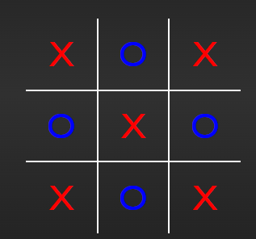

# **TIC-TAC-TOE**
---
# Idiomas/Languages: [Español](#es-un-juego-simple-de-tres-en-raya-hecho-con-html-css-y-javascript-que-lo-disfruten)/[English](#en-a-simple-tic-tac-toe-game-made-with-html-css-and-javascript-enjoy-it)
---
## ES: Un juego simple de tres en raya hecho con html, css y javascript. Que lo disfruten \(: 
### Archivos y carpetas:
----
   > `index.html`:
        Este archivo es el mas importante, contiene el layout 
        del tic-tac-toe, y es el que conecta cada .css y .js 
        para formar el juego.
    `index.js:`
        Este es el encargado de controlar cada modulo, clase,
        y objeto presentes en este juego. Este controla a
        cada archivo de la carpeta modules. Que contiene
        cada una de las funcionalidades antes dichas.
    `assets/modules/`
        Esta carpeta como ya dije, contiene diversas 
        funcionalidades, entre las cuales estan:
            `Game.js`:
                Contiene la clase Game, que es esencial,
                esta clase contiene informacion de como se
                gano, quien gano, cuantos movimientos se han
                hecho, en que posicion, por quien, reseteos,
                verificaciones, establecer movimientos, etc...
                Tambien contiene una matriz del juego en si,
                lo cual aumenta mas su utilidad.
            `Move.js`:
                Aunque al principio parece facil y sencillo,
                lo realmente importante de aqui, es que si
                bien solo almacena los movimientos, es el
                principal responsable del renderizado, 
                manejo de quien lo realizo, y las cordenadas
                en la matriz que ocupa dicho movimiento.
            `WinCases.js`:
                Este, a la hora de funcionalidad, no es que
                hace la gran cosa, pero, a la hora de decidir
                quien gano y como, para trazar la linea tan 
                iconica de este juego, es donde de verdad
                brilla, podriamos pensar que el tic-tac-toe,
                es simple, y que solo hay ocho formas de 
                ganar, pero si lo piensas un poco, y si la
                partida queda un ejemplo...
                asi:
                 
                Parece tonteria, pero en realidad 
                es un caso que nunca es cubierto en los tres en 
                raya habituales, ni siquiera en el
                minijuego de tres en raya **POR GOOGLE** es
                cubierto este caso, asi que me decidi a
                cubrir **22 CASOS CON MAS DE 200 LINEAS
                DE CODIGO** en ves de los 8 habituales, para tener la mejor experiencia de juego.
        `assets/styles`:
            Esta carpeta, simplemente contiene los estilos CSS
            de cada parte del juego:
                1. `style.css`: Este contiene los estilos
                generales del juego, como el body, la
                etiqueta main, entre otros aspectos como
                clases custom del sweetAlert.
                2. `gameStats.css`: Estos son los estlos
                del contador de vistorias de cada jugador,
                la verdad se me hiso dificil colocar
                esta cajita en un lugar que se viera bien y 
                sobre todo responsivo para casi cualquier
                dispositivo.
                3. `gameBoxes.css`: Se que el tres en raya
                usa lineas y no cajas, pero lo llame
                asi ya que primero, todo en CSS es una caja,
                y segundo, se comporta como caja. En 
                resumidas cuentas, contiene los estilos
                de las divisiones osea cajitas que se
                hacen con las lineas (bordes de las cajitas)
                4. `victorLines.css`: Yep, las lineas
                de victoria tambien son elementos HTML, los
                cuales les tuve que poner sus estilos
                propios, como color, opacidad, 
                animaciones, y mas cosas.
            
                

----
### Espero que les haya servido este proyecto y que les haya gustado este proyecto, me costo tiempo, habilidad y esfuerzo hacerlo, ahora tienen un tres en raya para compartir con sus amigos un rato de entretenimiento y diversion.
### PD: No usar las `Issues` como chat, si tienes un error, crea una`Issue` con la informacion del error y ya.
#### Asistencia por Github copilot usada

## EN: A simple tic-tac-toe game made with html, css and javascript. Enjoy it \(: 

### Files and folders:
----
   > `index.html`:
        This file is the most important; it contains the layout
        of the tic-tac-toe, and it is the one that links each .css and .js
        to build the game.
    `index.js:`
        This file is responsible for controlling each module, class,
        and object present in this game. It manages each file inside the modules folder, which contains
        the functionalities mentioned above.
    `assets/modules/`
        This folder, as previously stated, contains several
        functionalities, among which are:
            `Game.js`:
                Contains the Game class, which is essential;
                this class holds information about how a win occurred, who won, how many moves have
                been made, in which position, by whom, resets,
                checks, setting moves, etc...
                It also contains a matrix of the game itself,
                which increases its usefulness.
            `Move.js`:
                Although at first it seems easy and simple,
                the most important thing here is that while it only stores the moves, it is
                primarily responsible for rendering,
                handling who made the move, and the coordinates
                in the matrix that the move occupies.
            `WinCases.js`:
                This one, in terms of functionality, does not seem like much,
                but when deciding who won and how, to draw the iconic line
                of this game, this is where it truly shines. We could think that tic-tac-toe
                is simple and that there are only eight ways to win, but if you think about it a bit, and if
                the match ends like the example...
                like this:
                 
                It may seem silly, but in reality
                it is a case that is never covered in the usual tic-tac-toe games, not even the
                Google's tic-tac-toe mini-game covers this case, so I decided to
                cover **22 CASES WITH MORE THAN 200 LINES
                OF CODE** instead of the usual 8, to provide the best gaming experience.
        `assets/styles`:
            This folder simply contains the CSS styles
            for each part of the game:
                1. `style.css`: Contains the general styles
                for the game, like the body, the
                main tag, and other aspects such as
                custom SweetAlert classes.
                2. `gameStats.css`: These are the styles
                for the victory counter of each player;
                it was honestly difficult to place
                this little box in a spot that looked good and
                was responsive for almost any device.
                3. `gameBoxes.css`: I know tic-tac-toe
                uses lines and not boxes, but I called it
                that because first, everything in CSS is a box,
                and second, it behaves like a box. In
                short, it contains the styles
                for the divisions—i.e., the little boxes made
                with lines (the borders of the little boxes)
                4. `victorLines.css`: Yep, the victory
                lines are also HTML elements, for which
                I had to add their own styles,
                such as color, opacity,
                animations, and more.
            

----
### I hope this project has been helpful and that you liked it; it took me time, skill, and effort to make. Now you have a tic-tac-toe to share with your friends for a while of entertainment and fun.

### PS: Don't use de `Issues` as a  chat, if you have an error, made an `Issue` with the info. of the error. 
#### Github copilot assit used
